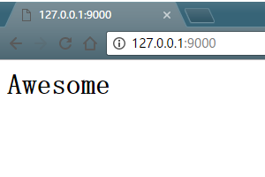

#**awesome-python3-webapp**
参考学习来源：[廖雪峰python3教程](http://www.liaoxuefeng.com/wiki/0014316089557264a6b348958f449949df42a6d3a2e542c000)<br>
测试平台：Windows10 + Python 3.5.2 + MySQL Community Server 5.6.35
---
####Day 1 - 搭建开发环境
#####搭建开发环境

>首先，确认系统安装的Python版本是`3.5.x`：

```python
    E:\virtualenv> python3 --version
    Python 3.5.2
```

>然后，用`virtualenv`创建隔离的开发环境

```python
    E:\virtualenv> virtualenv awesome-python3-webapp --no-site-packages --python=D:\Python35\python.exe
    Running virtualenv with interpreter D:\Python35\python.exe
    Using base prefix 'D:\\Python35'
    New python executable in E:\virtualenv\awesome-python3-webapp\Scripts\python.exe
    Installing setuptools, pip, wheel...done.
```

>激活`virtualenv`：

```python
    E:\virtualenv> cd awesome-python3-webapp\Scripts
    E:\virtualenv\awesome-python3-webapp\Scripts> activate
    (awesome-python3-webapp) E:\virtualenv\awesome-python3-webapp\Scripts>
```

>接下来用`pip`安装开发Web APP需要的第三方库(以下安装都是使用豆瓣的源)：<br>
>异步框架`aiohttp`：

```python
    (awesome-python3-webapp) E:\virtualenv\awesome-python3-webapp\Scripts>pip3 install -i https://pypi.douban.com/simple aiohttp
```

>前端模板引擎`jinja2`：

```python
    (awesome-python3-webapp) E:\virtualenv\awesome-python3-webapp\Scripts>pip3 install -i https://pypi.douban.com/simple jinja2
```

>MySQL的Python异步驱动程序`aiomysql`(MySQL 5.x数据库已经提前安装好)：

```python
    (awesome-python3-webapp) E:\virtualenv\awesome-python3-webapp\Scripts>pip3 install -i https://pypi.douban.com/simple aiomysql
```

#####项目结构

>选择一个工作目录，然后新建如下的目录结构：

    awesome-python3-webapp/     <--- 根目录
    |
    +—— backup/                 <---- 备份目录
    |
    +—— conf/                   <---- 配置文件目录
    |
    +—— dist/                   <---- 打包目录
    |
    +—— www/                    <---- Web目录，存放.py文件
    |   |
    |   +—— static/             <---- 存放静态文件
    |   |
    |   +—— templates/          <---- 存放模板文件
    |
    +—— ios/                    <---- 存放IOS APP工程
    |
    +—— LICENSE                 <---- LICENSE文件

>创建好项目的目录结构后，建立[git](https://www.git-scm.com/)仓库`awesome-python3-webapp`并同步至[github](https://github.com)，保证代码修改的安全。

#####开发工具

>[Sublime Text3](http://www.sublimetext.com/3) + [PyCharm](https://www.jetbrains.com/pycharm/)

####Day 2 - 编写Web App骨架

>由于我们的Web APP建立在`asyncio`的基础上，因此我们用`aiohttp`编写一个基本的`app.py`：

```python
    import logging
    import asyncio
    import os
    import json
    import time
    from datetime import datetime
    from aiohttp import web

    logging.basicConfig(level=logging.INFO)


    def index(request):
        return web.Response(body=b'<h1>Awesome</h1>', content_type='text/html')


    @asyncio.coroutine
    def init(loop):
        app = web.Application(loop=loop)
        app.router.add_route('GET', '/', index)
        srv = yield from loop.create_server(app.make_handler(), '127.0.0.1', 9000)
        logging.info('server started at http://127.0.0.1:9000')
        return srv

    loop = asyncio.get_event_loop()
    loop.run_until_complete(init(loop))
    loop.run_forever()
```

>在终端运行`app.py`，Web APP将在`9000`端口监听HTTP请求，并对首页`/`进行响应：

```python
    (awesome-python3-webapp) e:\workspace\python\awesome-python3-webapp>python app.py
    INFO:root:server started at http://127.0.0.1:9000
```

>然后在浏览器端访问`http://127.0.0.1:9000`，将显示标题h1样式的'Awesome'：<br>

<br>

>并在终端输出以下信息：

```python
    INFO:aiohttp.access:127.0.0.1 - - [13/Jan/2017:01:42:33 +0000] "GET / HTTP/1.1" 200 16 "-" "Mozilla/5.0 (Windows NT 10.0; Win64; x64) AppleWebKit/537.36 (KHTML, like Gecko) Chrome/55.0.2883.87 Safari/537.36"
```

>这说明我们的Web APP骨架已经搭建好了，可以进一步往里面添加更多的东西。<br>

>运行完毕按`Ctrl+C`结束程序。

---

>对`asyncio`的部分说明：<br>

    asyncio是Python 3.4版本引入的标准库，直接内置了对异步IO的支持。
    asyncio的编程模型就是一个消息循环。我们从asyncio模块中直接获取一个EventLoop的引用。然后把需要执行的协程扔到EventLoop中执行，
    就实现了异步IO。
    @asyncio.coroutine把一个generator标记为coroutine类型，然后我们就把这个coroutine扔到EventLoop中执行。

>对`app.py`其他部分的说明：

    待添加...

####Day 3 - 编写ORM

在一个Web APP中，所有数据，包括用户信息、发布的日志、评论等，都是存储在数据库中的。所以在这个`awesome-python3-webapp`项目中，我们选择MySQL数据库。

Web App里面有很多地方都要访问数据库。访问数据库需要创建数据库连接、游标对象，然后执行SQL语句，最后处理异常，清理资源。这些访问数据库的代码如果分散到各个函数中，势必无法维护，也不利于代码的复用。

所以，我们要首先把常用的SELECT、INSERT、UPDATE和DELETE操作用函数封装起来。

由于Web框架使用了基于`asyncio`的`aiohttp`，这是基于协程的异步模型。在协程中，不能调用普通的同步IO操作，因为所有用户都是由一个线程服务的，协程的执行速度必须非常快，才能处理大量用户的请求。而耗时的IO操作不能在协程中以同步的方式调用，否则，等待一个IO操作时，系统无法响应任何其他用户。

这就是异步编程的一个原则：一旦决定使用异步，则系统每一层都必须是异步，“开弓没有回头箭”。

幸运的是`aiomysql`为MySQL数据库提供了异步IO的驱动

>创建连接池

我们需要创建一个全局的连接池，每个HTTP请求都可以从连接池中直接获取数据库连接。使用连接池的好处是不必频繁地打开和关闭数据库连接，而是能复用就尽量复用。

连接池由全局变量`__pool`存储，缺省情况下将编码设置为`utf8`，自动提交事务：

```python
    @asyncio.coroutine
    def create_pool(loop, **kw):
        logging.info('create database connection pool...')
        global __pool
        __pool = yield from aiomysql.create_pool(
            host=kw.get('host', 'localhost'),
            port=kw.get('port', 3306),
            user=kw['user'],
            password=kw['password'],
            db=kw['db'],
            charset=kw.get('charset', 'utf8'),
            autocommit=kw.get('autocommit', True),
            maxsize=kw.get('maxsize', 10),
            minsize=kw.get('minsize', 1),
            loop=loop
        )
```

>Select

要执行SELECT语句，我们用`select`函数执行，需要传入SQL语句和SQL参数：

```python
    @asyncio.coroutine
    def select(sql, args, size=None):
        log(sql, logs)
        global __pool
        with (yield from __pool) as conn:
            cur = yield from conn.cursor(aiomysql.DictCursor)
            yield from cur.execute(sql.replace('?', '%s'), qrgs or ())
            if size:
                rs = yield from cur.fetchmany(size)
            else:
                rs = yield from cur.fetchall()
            yield from cur.close()
            logging.info('rows returned: %s' % len(rs))
            return rs
```

SQL语句的占位符是`?`，而MySQL的占位符是`%s`，select()函数在内部自动替换。注意要始终坚持使用带参数的SQL，而不是自己拼接SQL字符串，这样可以防止SQL注入攻击。

注意到`yield from`将调用一个子协程(也就是在一个协程中调用另一个协程)并直接获得子协程的返回结果。

如果传入`size`参数，就通过`fetchmany()`获取最多指定数量的记录，否则，通过`fetchal()`获取所有记录。

>Input, Update, Delete

要执行INSERT、UPDATE、DELETE语句，可以定义一个通用的`execute()`函数，因为这3种SQL的执行都需要相同的参数，以及返回一个整数表示影响的行数：
```python
    @asyncio.coroutine
    def execute(sql, args):
        log(sql)
        with (yield from __pool) as conn:
            try:
                cur = yield from conn.cursor()
                yield from cur.execute(sql.replace('?', '%s'), args)
                affected = cur.rowcount()
                yield from cur.close()
            except BaseException as e:
                raise
            return affected
```

`execute()`函数与`select()`函数所不同的是，cursor对象返回的不是结果集，而是通过`rowcount`返回影响的结果数。

>ORM

有了基本的`select()`和`execute()`函数，我们就可以开始编写一个简单的ORM了。

设计ORM需要从上层调用者角度来设计。

我们先考虑如何定义一个`User`对象，然后把数据库表`users`和它关联起来。
```python
    from orm import Model, StringField, IntegerField

    class User(Model):
        __table__ = 'users'

        id = IntegerField(primary_key=True)
        name = StringField()
```

注意到定义在`User`类中的`__table__`、`id`和`name`是类的属性，不是实例的属性。所以，在类级别上定义的属性用来描述`User`对象和表的映射关系，而实例属性必须通过`__init__()`方法去初始化，所以两者互不干扰：
```python
    # 创建实例
    user = User(id=123, name='gitzzg')
    # 存入数据库
    user.insert()
    # 查询所有User对象
    users = User.findAll()
```

>定义Model

首先要定义的是所有ORM映射的基类`Model`：
```python
    class Model(dict, metaclass=ModelMetaclass):

        def __init__(self, **kw):
            super(Model, self).__init__(**kw)

        def __getattr__(self, key):
            try:
                return self[key]
            except KeyError:
                raise AttributeError(r"'Model' ocject has no attribute '%s'" % key)
        def __setattr__(self, key, value):
            self[key] = value

        def getValue(self, key):
            return getattr(self, key, None)

        def getValueOrDefault(self, key):
            value = getattr(self, key, None)
            if value is None:
                field = self.__mappings__[key]
                if field.default is not None:
                    value = field.default() if callable(field, default) else field, default
                    logging.debug('using default value for %s: %s' % (key, str(value)))
                    setattr(self, key, value)
            return value
```
`Model`从`dict`继承，所以具备所有`dict`的功能，同时又实现了特殊方法`__getattr__()`和`__setattr__()`，因此又可以像引用普通字段那样写：
```python
    >>> user['id']
    123
    >>> user.id
    123
```
以及`Field`和各种`Field`子类：
```python
    class Field(object):

        def __init__(self, name, column_type, primary_key, default):
            self.name = name
            self.column_type = column_type
            self.primary_key = primary_key
            self.default = default

        def __str__(self):
            return '<%s, %s:%s>' % (self.__class__.__name__, self.column_type, self.name)
```
映射`varchar`的`StringField`：
```python
    class StringField(Field):

        def __init__(self, name=None, primary_key=False, default=None, ddl='varchar(100)'):
            super().__init__(name, ddl, primary_key, default)
```
注意到`Model`只是一个基类，如何将具体的子类如`User`的映射信息读取出来呢？答案就是通过metaclass：`ModelMetaclass`：
```python
    class ModelMetaclass(type):

        def __new__(cls, name, bases, attrs):
            # 排除Model类本身
            if name == 'Model':
                return type.__new__(cls, name, bases, attrs)
            # 获取table名称
            tableName = attrs.get('__table__', None) or name
            logging.info('found model: %s (table: %s)' % (name, tableName))
            # 获取所有的Field和主键名
            mappings = dict()
            fields = []
            primaryKey = None
            for k, v in attrs.items():
                if isinstance(v, Field):
                    logging.info('found mapping: %s ==> %s' % (k, v))
                    mappings[k] = v
                    if v.primary_key:
                        # 找到主键
                        if primaryKey:
                            raise RuntimeError('Duplicate primary key for field: %s' % k)
                        primaryKey = k
                    else:
                        fields.append(k)
            if not primaryKey:
                raise RuntimeError('Primary key not found.')
            for k in mappings.keys():
                attrs.pop(k)
            escaped_fields = list(map(lambda f:'%s' % f, fields))
            attrs['__mappings__'] = mappings  # 保存属性和列的映射关系
            attrs['__table__'] = tableName
            attrs['__primary_key__'] = primaryKey  # 主键属性名
            attrs['__fields__'] = fields  # 除主键外的属性名
            # 构造默认的SELECT、INSERT、UPDATE和DELETE语句：
            attrs['__select__'] = 'select `%s`
            attrs['__insert__']
            attrs['__update__']
            attrs['__delete__']
```